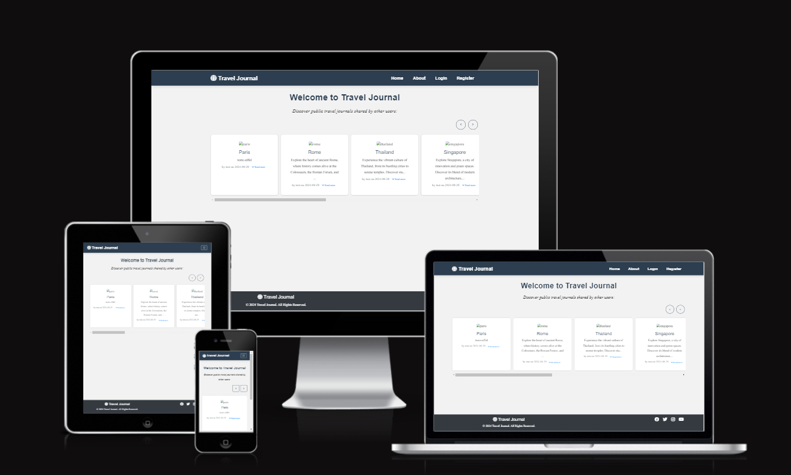
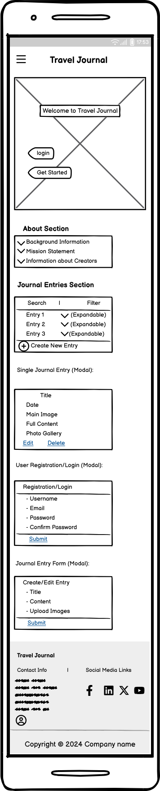
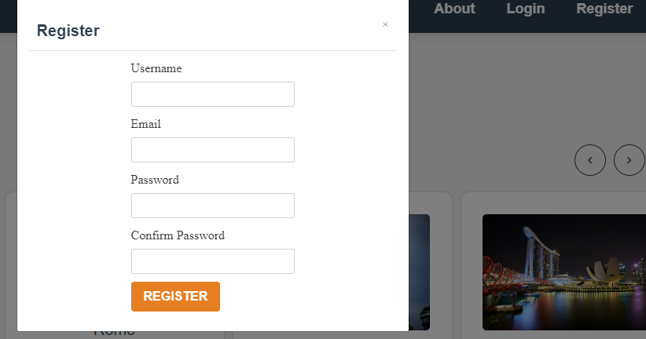
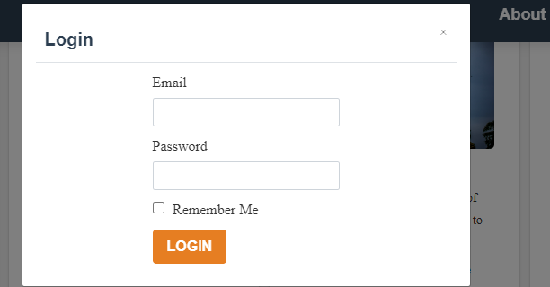

# Travel Journal

## Project Overview

**Travel Journal** is a web application designed to help travellers document and share their journeys. Users can create personal accounts, log their travel experiences through journal entries, and enrich these entries with photos. The platform provides a user-friendly interface with essential features like creating, reading, updating, and deleting journal entries, along with options to make entries public or private. With built-in search and filter functionalities, users can easily find specific entries based on destinations or dates, making it an ideal tool for keeping a detailed and organised travel diary.

Key features of Travel Journal include:

- **Account Management**: Secure user registration, login, and account management.
- **Journal Management**: CRUD (Create, Read, Update, Delete) operations for journal entries with optional image uploads.
- **Search and Filtering**: Easily find journal entries by destination, date, or keywords.
- **Responsive Design**: Accessible on all devices, including mobile, tablet, and desktop, ensuring a seamless experience across platforms.

Travel Journal aims to foster a community of travel enthusiasts who can share their experiences and inspire others through their journeys. Whether for personal reflection or public sharing, the platform is tailored to make travel journaling intuitive and enjoyable.




## Table of Contents
- [Travel Journal](#travel-journal)
  - [Project Overview](#project-overview)
  - [Table of Contents](#table-of-contents)
  - [User Experience (UX)](#user-experience-ux)
    - [User Stories](#user-stories)
      - [1 - Account Management](#1---account-management)
      - [2 - Journal Management](#2---journal-management)
      - [3 - Search and Accessibility](#3---search-and-accessibility)
      - [4- User Experience](#4--user-experience)
      - [5 - Privacy and Sharing](#5---privacy-and-sharing)
    - [Site Goals](#site-goals)
      - [For New Site Users](#for-new-site-users)
      - [For Returning Site Users](#for-returning-site-users)
      - [General Goals](#general-goals)
  - [How to Meet User Requirements](#how-to-meet-user-requirements)
    - [1 - Account Management](#1---account-management-1)
    - [2 - Journal Management](#2---journal-management-1)
    - [3 - Search and Accessibility](#3---search-and-accessibility-1)
    - [4 - User Experience](#4---user-experience)
    - [5 - Privacy and Sharing](#5---privacy-and-sharing-1)
    - [Design Choices](#design-choices)
      - [Colour Scheme](#colour-scheme)
      - [Typography](#typography)
      - [Imagery](#imagery)
  - [Wireframes](#wireframes)
    - [Wireframe Creation](#wireframe-creation)
  - [Future](#future)
    - [**Base Template (`base.html`)**](#base-template-basehtml)
  - [Deployment](#deployment)
    - [Local Deployment](#local-deployment)
  


## User Experience (UX)

### User Stories


####  1 - Account Management

- **As a new user, I want to create an account with a secure password and receive a confirmation, so that I can start saving my travel journal entries and personalise my experience.**

- **As a user, I want to log in and log out of my account easily, so that I can manage my sessions securely.**
- **As a returning user, I want to reset my password if I forget it, so that I can regain access to my account without issues.**
- 
#### 2 - Journal Management

- **As a user, I want to create, read, update, and delete my journal entries, so that I can keep an organised record of my travels.**
- **As a user, I want to upload photos with my journal entries, so that I can visually document my experiences.**
- **As a user, I want to add tags or categories to my journal entries, so that I can easily organise and find them later.**
  
#### 3 - Search and Accessibility

- **As a user, I want to search and filter journal entries by destination or date, so that I can quickly find specific entries.**
- **As a user, I want to view my journal entries on different devices, including mobile, tablet, and desktop, so that I can access my journals anytime, anywhere.**
  
#### 4- User Experience

- **As a first-time visitor, I want to understand the purpose of the website immediately, so that I know what value it offers me.**
- **As a user, I want clear and friendly error messages, so that I can easily understand and correct any issues I encounter.**
#### 5 - Privacy and Sharing

- **As a user, I want to set my journal entries as public or private, so that I have control over who can see my content.**
- **As a user, I want to be able to share my public journal entries with others, so that I can inspire friends or other travellers.**

### Site Goals

#### For New Site Users
- **Create a Seamless Onboarding Experience**: Ensure new users can easily understand the platform’s purpose and get started quickly with clear onboarding instructions and tutorials.
- **Simplify Account Creation**: Provide a straightforward and secure process for new users to register, including guidance on setting up their profile and starting their first journal entry.
- **Enhance Discoverability**: Make it easy for new users to explore the features of the platform and understand how to use them effectively.

#### For Returning Site Users
- **Streamline Account Management**: Offer easy-to-access options for returning users to log in, manage their account settings, and reset passwords if needed.
- **Facilitate Entry Management**: Ensure returning users can quickly create, read, update, and delete journal entries with minimal friction.
- **Provide Enhanced Search and Filtering**: Improve search and filter functionalities to help returning users find specific entries or browse through their travel history more efficiently.

#### General Goals
- **Provide a Platform for Documenting and Sharing Travel Experiences**: Allow users to create, read, update, and delete journal entries, and upload photos to enrich their entries.
- **Offer Robust Search and Filter Functionality**: Help users find journal entries by destination, date, or tags.
- **Ensure Responsiveness and User-Friendliness**: Make sure the application works seamlessly across all devices, including mobile, tablet, and desktop.


## How to Meet User Requirements

### 1 - Account Management

- **Secure Registration and Confirmation**: Implement secure authentication protocols and email verification for account creation, ensuring users receive a confirmation upon successful registration.
- **Easy Login/Logout**: Design an intuitive interface for logging in and out, with clear navigation and session management options.
- **Password Reset**: Include a straightforward password recovery system with verification steps to allow users to regain access if they forget their password.

### 2 - Journal Management

- **CRUD Operations**: Provide a user-friendly interface for creating, reading, updating, and deleting journal entries, making it easy for users to manage their travel logs.
- **Photo Uploads**: Integrate a feature for uploading and attaching photos to journal entries, enhancing the visual documentation of travel experiences.
- **Tags/Categories**: Enable users to add tags or categories to their entries, facilitating easier organization and retrieval of journal content.

### 3 - Search and Accessibility

- **Search and Filter**: Implement robust search and filtering options to allow users to find journal entries by destination, date, or keywords efficiently.
- **Responsive Design**: Ensure the application is fully responsive, providing a seamless experience across mobile, tablet, and desktop devices.

### 4 - User Experience

- **Clear Purpose**: Design a clear and intuitive landing page to communicate the site’s value and purpose effectively to new visitors.
- **Error Messages**: Implement user-friendly error messages that provide clear guidance and support for resolving issues encountered during use.

### 5 - Privacy and Sharing

- **Privacy Controls**: Allow users to set the visibility of their journal entries as public or private, giving them control over who can view their content.
- **Sharing Features**: Provide options for users to share their public entries through social media or direct links, enabling them to connect and inspire others.


### Design Choices

#### Colour Scheme

The colour scheme has been thoughtfully crafted to evoke a sense of adventure, vibrancy, and clarity. Colours have been selected to create a cohesive palette that enhances user experience and interface aesthetics. The primary colours used are Midnight Blue for a reliable foundation, Tangerine for vibrant highlights, and Emerald Green for refreshing accents. Light Grey serves as a soft backdrop, while Dark Grey ensures clear and readable text.

- **Primary Colour**: Midnight Blue (#2C3E50) – A deep, dependable blue.
- **Secondary Colour**: Tangerine (#E67E22) – A bright, energetic orange.
- **Accent Colour**: Emerald Green (#2ECC71) – A refreshing, vibrant green.
- **Background Colour**: Light Grey (#F2F2F2) – A neutral, unobtrusive backdrop.
- **Text Colour**: Dark Grey (#333) – A strong, readable grey for text.

**Hover Effects**: 
- **Tangerine Hover**: Dark Tangerine (#D35400) – A darker shade for a more pronounced hover effect.
- **Danger Hover**: Danger Red Hover (#C0392B) – A deeper red for clear, intense hover feedback.

To create a harmonious palette, these colours were used to generate a cohesive colour scheme. You can explore and create your own colour palettes using tools such as [Coolors](https://coolors.co/).


#### Typography

The typography is designed to ensure clarity and readability while complementing the overall aesthetic of the site. The font choices are made to enhance the user experience across various elements of the application.

- **Heading Font**: Montserrat (sans-serif)
  - Used for headings (`h1`, `h2`, `h3`, `h4`, `h5`) to ensure a clean and modern look. It’s applied with varying font sizes and weights to create a clear visual hierarchy.
  - Example: `h1` is set to 3.6rem with a font-weight of 700, and `h5` is set to 2rem with text-transform: capitalize.

- **Body Font**: Merriweather (serif)
  - Chosen for body text and paragraphs for its readability and elegant serif design. It supports the main content and provides a balanced contrast to the heading font.
  - Example: Body text is set to 1.6rem with a line-height of 1.8, and special paragraphs (`.lead`) are slightly larger at 2rem with oblique styling.

- **Accent Font**: Dancing Script (cursive)
  - Used sparingly for accent elements to add a touch of personality and flair where needed.

The typography styles are applied consistently across the application to maintain a cohesive look and feel.

#### Imagery
Imagery is carefully selected to inspire and enhance the travel journaling experience.

- **User-Uploaded Photos**: The primary images on the website are taken from users who upload their travel photos. This feature allows for a personalized and authentic representation of travel experiences.
- **Stock Photos**: For demonstration and initial setup, stock images from [Pexels](https://www.pexels.com) are used. These images help illustrate the site’s design and functionality.
- **Hero Images**: Currently, hero images (large, prominent visuals) are not included due to time constraints. However, adding engaging hero images showcasing stunning travel destinations is a planned feature for future updates. These images will enhance the visual appeal of the website and draw users' attention.
- **Icons**: The icons used throughout the site are sourced from [Font Awesome](https://fontawesome.com). Font Awesome provides a wide range of scalable vector icons that are easy to customize and integrate into the site's design.


## Wireframes
<details>
<summary>Mobile Wireframe</summary>



</details>

### Wireframe Creation

For the design of the Travel Journal application, wireframes were created using Balsamiq, a tool known for its simplicity and effectiveness in sketching out user interfaces. Initially, I focused on developing wireframes specifically for mobile screens. This approach allowed me to address the most critical aspects of the user interface on smaller devices before adapting the design for larger screens.

Due to time constraints, wireframes for medium and large screens were not created. Instead, the mobile wireframe served as a foundational guide. While the wireframe depicted in the image provided a starting point, many elements and layouts have evolved since its creation. The wireframe has been used primarily as a reference, and adjustments have been made to better meet user needs and improve overall design.

Future improvements will include creating and refining wireframes for medium and large screens to ensure a fully responsive and well-designed user experience across all device sizes.

</details>

## Future

### **Base Template (`base.html`)**

The `base.html` template is the foundation of the website's layout, ensuring a consistent look and feel across all pages. Here’s what’s planned for the future:

- **Header**:
  - **Navigation Bar**:
    - The navigation bar will feature links to Home, About, Journal Entries, and Account pages.
  
    
  - **User Interaction**:
    - **Login/Register Buttons**: Displayed prominently when the user is not logged in.
     
  

- **Footer**:
  - **Contact Information**: To include links to contact support or social media.
    - 

- **Responsive Design**:
  - **Mobile and Desktop Views**: The base template is designed to adapt to different screen sizes.
  
  | Full Home View | Tablet Design | Mobile Design |
  |:---------------------------:|:--------------------------:|:-------------------------:|
  |  |  |  |

- **Additional Features**:
  - **Dynamic Content Loading**: Support for dynamically loading content such as modals or dropdowns.
    - 


- **Additional Features**:
  - **Dynamic Content Loading**: Support for dynamically loading content such as modals or dropdowns.
    - 


## Deployment

### Local Deployment

To run this project locally, follow these steps:

1. **Clone the Repository**:
   
   Clone the repository to your local machine using the following command:

   ```bash
   git clone https://github.com/CapricornoG/travel_journal.git